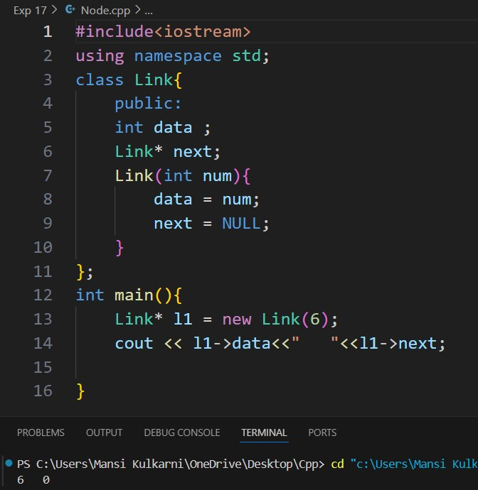
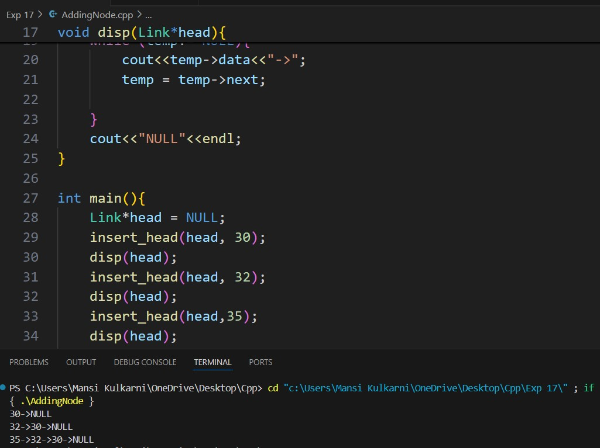

# Experiment 17
## Linked Lists
## Software used: 
Visual Studio Code
## Theory:
A linked list is a linear data structure that allows the users to store data in non-contiguous memory locations. A linked list is defined as a collection of nodes where each node consists of two members which represents its value and a next pointer which stores the address for the next node. In this article, we will learn about the linked list, its implementation, and its practical applications. 
## Outputs:
### Nodes

### Adding Nodes

